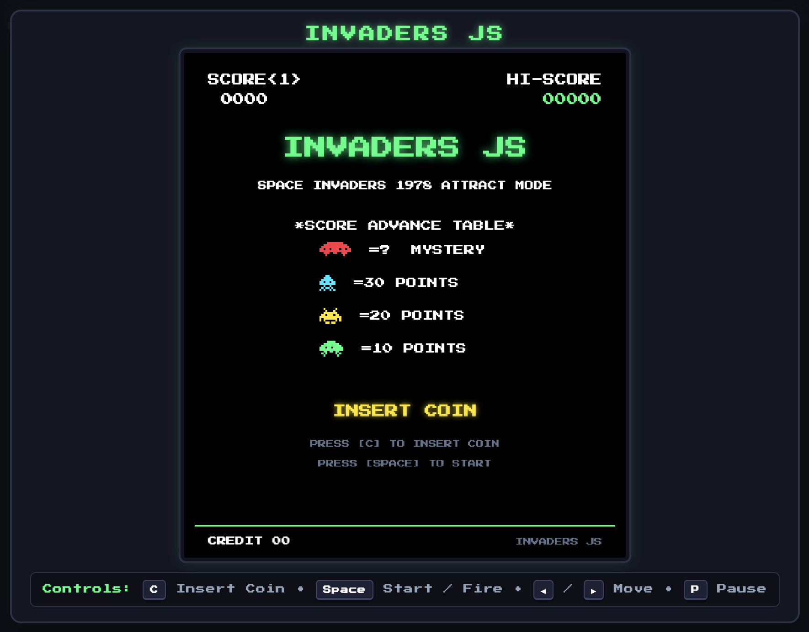

# Invaders JS

Invaders JS is an authentic arcade recreation of the 1978 classic **Space Invaders**, built with HTML5 Canvas, the Web Audio API, and Vanilla JavaScript.



## Getting Started

### Prerequisites

- [Node.js](https://nodejs.org/) (v18 or higher recommended)

### Installation

```bash
npm install
```

### Development

Start the local Vite development server with Hot Module Replacement (HMR):

```bash
npm run dev
```

### Production Build

Bundle and minify the game for production into the `dist/` directory (automatically runs linter and Prettier checks before bundling):

```bash
npm run build
```

### Linting & Code Formatting

The project uses [ESLint](https://eslint.org/) and an opinionated [Prettier](https://prettier.io/) configuration for code quality and style consistency:

- **Run linter**:
  ```bash
  npm run lint
  ```
- **Run lint & fix** (automatically fixes lint errors and formats all files with Prettier):
  ```bash
  npm run lint:fix
  ```
- **Check code formatting**:
  ```bash
  npm run format:check
  ```

### Preview Production Build

Preview the production build locally:

```bash
npm run preview
```

## Controls

- **[C]**: Insert Coin
- **[Space]**: Start / Fire Laser
- **[Left Arrow]** / **[Right Arrow]**: Move Cannon
- **[P]**: Pause / Resume
